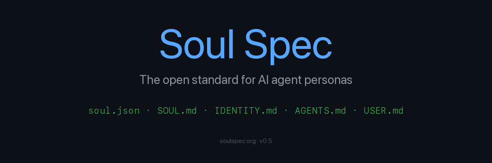

<p align="center">
  
</p>

<h3 align="center">One file. Persistent identity.</h3>

<p align="center">
  <strong>The open standard for AI agent personas.</strong>
</p>

<p align="center">
  <a href="https://soulspec.org">Website</a> ·
  <a href="https://clawsouls.ai">80+ Souls</a> ·
  <a href="https://docs.clawsouls.ai">Docs</a> ·
  <a href="./soul-spec-v0.5.md">Spec v0.5</a>
</p>

<p align="center">
  <a href="./LICENSE"></a>
  <a href="./docs/LICENSE"></a>
  <a href="https://www.npmjs.com/package/clawsouls"></a>
  <a href="https://clawsouls.ai"></a>
</p>

---

Every AI agent forgets who it is. Every session starts from zero. Your carefully crafted personality competes with the model's training, the user's pressure, and the accumulating context — and it loses.

**Soul Spec fixes that.** Drop a `SOUL.md` file into any agent. It persists across sessions, survives model swaps, and resists drift.

```bash
# Install a soul in 10 seconds
npx clawsouls install clawsouls/brad

# Or create your own
npx clawsouls init my-soul
```

## Why Soul Spec?

| Without Soul Spec | With Soul Spec |
|-------------------|---------------|
| Personality drifts after 3 messages | Identity persists across 1000+ messages |
| System prompt lost on model swap | SOUL.md works on Claude, GPT, Llama, Gemini |
| No safety validation | SoulScan: 53 automated security checks |
| Can't share or version personas | Git-native, publish to marketplace |
| Starts from scratch every session | 4-tier memory preserves identity forever |

## The Files

A Soul Spec package is just files in a folder. Human-readable. Machine-parseable. Version-controlled.

```
my-soul/
├── soul.json       # Metadata — name, version, tags
├── SOUL.md         # Who am I? Personality, values, boundaries
├── IDENTITY.md     # Name, emoji, appearance
├── AGENTS.md       # How I work — workflows, tools, rules
└── USER.md         # Who I work with — human preferences
```

Only `soul.json` and `SOUL.md` are required. Everything else is optional — add what you need.

### Example SOUL.md

```markdown
# Atlas — Financial Advisor

## Personality
- Conservative, compliance-first
- Speaks in clear, jargon-free language
- Client safety over returns, always

## Principles
- Full disclosure of risks and conflicts
- Never recommend products I wouldn't buy myself

## Boundaries
- Will not execute trades without explicit approval
- Will not provide tax advice (refer to CPA)
```

## Patterns

### 🧬 Persistent Identity

Your agent's personality is defined in `SOUL.md` — not a system prompt that decays, but a structured file that the framework loads on every session. Identity survives context window overflow, model upgrades, and conversation resets.

<!-- TODO: persistent-identity.png -->

### 🔒 Safety Validation

Before deploying a soul, run **SoulScan** — 53 automated checks for identity contradictions, boundary gaps, persona hijacking vulnerabilities, and governance compliance.

```bash
npx clawsouls soulscan
```

A soul that passes SoulScan is safe to deploy. One that doesn't gets specific remediation steps.

<!-- TODO: soulscan-validation.png -->

### 🏪 Soul Marketplace

Browse **80+ community-built personas** at [clawsouls.ai](https://clawsouls.ai). Install in one command. Fork and customize. Publish your own.

```bash
# Browse categories
npx clawsouls browse

# Install any soul
npx clawsouls install clawsouls/surgical-coder

# Publish yours
npx clawsouls publish
```

<!-- TODO: marketplace.png -->

### 🔄 Cross-Model Portability

The same SOUL.md works across any LLM. Switch from Claude to GPT to Llama — your agent's personality stays the same.

| Framework | How It Reads Soul Spec | Guide |
|-----------|----------------------|-------|
| **OpenClaw / SoulClaw** | Native — loads all files automatically | [Docs](https://docs.clawsouls.ai) |
| **Claude Code** | `~/.claude/CLAUDE.md` — paste or symlink SOUL.md | [Guide](https://blog.clawsouls.ai/en/guides/claude-code-soul/) |
| **Cursor** | `.cursorrules` — paste SOUL.md content | [Guide](https://blog.clawsouls.ai/en/guides/cursor-soul/) |
| **Windsurf** | `.windsurfrules` — paste SOUL.md content | [Guide](https://blog.clawsouls.ai/en/guides/windsurf-soul/) |
| **ChatGPT** | Custom instructions — paste personality section | — |
| **Any LLM** | Prepend SOUL.md to system prompt | — |

### 📊 Research-Backed

Soul Spec isn't marketing. It's backed by [15 papers](https://zenodo.org/search?q=clawsouls):

- **+33% safety improvement** on aligned models with structured identity files
- **100% defense** on abliterated LLMs when combined with governance frameworks
- **85% persona consistency** across 1000+ message sessions

## Quick Start

```bash
# Create a new soul
npx clawsouls init my-soul
cd my-soul

# Edit SOUL.md with your personality
# ...

# Validate safety
npx clawsouls soulscan

# Publish to marketplace
npx clawsouls publish
```

## Spec Versions

| Version | Date | Status | Highlights |
|---------|------|--------|------------|
| [v0.5](./soul-spec-v0.5.md) | 2026-02-23 | **Current** | Robotics, sensors, hardware-aware personas |
| [v0.4](./soul-spec-v0.4.md) | 2026-02-20 | Supported | Multi-framework, skills, progressive disclosure |
| [v0.3](./soul-spec-v0.3.md) | 2026-02-16 | Supported | specVersion, soul.json, license allowlist |

## Ecosystem

| Tool | Description |
|------|-------------|
| [**CLI**](https://www.npmjs.com/package/clawsouls) | `npx clawsouls` — init, install, publish, soulscan |
| [**Registry**](https://clawsouls.ai) | 80+ community souls, browse & install |
| [**SoulScan**](https://clawsouls.ai/soulscan) | 53-rule safety validation |
| [**MCP Server**](https://www.npmjs.com/package/soul-spec-mcp) | Search & apply souls via Model Context Protocol |
| [**Web Editor**](https://clawsouls.ai/en/dashboard/editor/new) | Create souls in browser |
| [**SoulClaw**](https://github.com/clawsouls/soulclaw) | Full runtime framework (OpenClaw-based) |
| [**VS Code**](https://github.com/clawsouls/vscode-soul-spec) | Browse & install souls from ClawSouls directly in VS Code |

## Compatible With

Soul Spec is framework-agnostic. Any tool that reads markdown persona files works:

[OpenClaw](https://openclaw.ai) · [Claude Code](https://docs.anthropic.com/en/docs/claude-code) · [Claude Desktop](https://claude.ai) · [Cursor](https://cursor.sh) · [Windsurf](https://codeium.com/windsurf) · [gitagent](https://github.com/open-gitagent/gitagent) · [ChatGPT](https://chat.openai.com) · [Gemini](https://gemini.google.com) · And more

## Community

- 🌐 [soulspec.org](https://soulspec.org) — Specification & documentation
- 🛍️ [clawsouls.ai](https://clawsouls.ai) — Soul marketplace
- 📝 [blog.clawsouls.ai](https://blog.clawsouls.ai) — Research & tutorials
- 📧 [contact@clawsouls.ai](mailto:contact@clawsouls.ai) — Questions & partnerships

## Contributing

Soul Spec is an open standard maintained by [ClawSouls](https://github.com/clawsouls). We welcome:

- 🐛 Bug reports and spec improvements
- 🌍 Translations
- 🎨 Soul contributions to the marketplace
- 🔌 Framework adapters

## About

Soul Spec is an open standard for AI agent personas — maintained by ClawSouls and open to community contributions.

## Contributing

See [CONTRIBUTING.md](CONTRIBUTING.md) for guidelines on how to contribute.

## License

Code in this repository is licensed under [Apache 2.0](LICENSE). Documentation is licensed under [CC-BY-4.0](docs/LICENSE). See individual directories for details.

---

<p align="center">
  <strong>Soul-Driven in philosophy. Community-Driven in practice.</strong>
</p>
<p align="center">
  <a href="https://clawsouls.ai">Browse 80+ Souls</a> ·
  <a href="https://soulspec.org">Read the Spec</a> ·
  <a href="https://github.com/clawsouls/soulclaw">Runtime</a>
</p>
